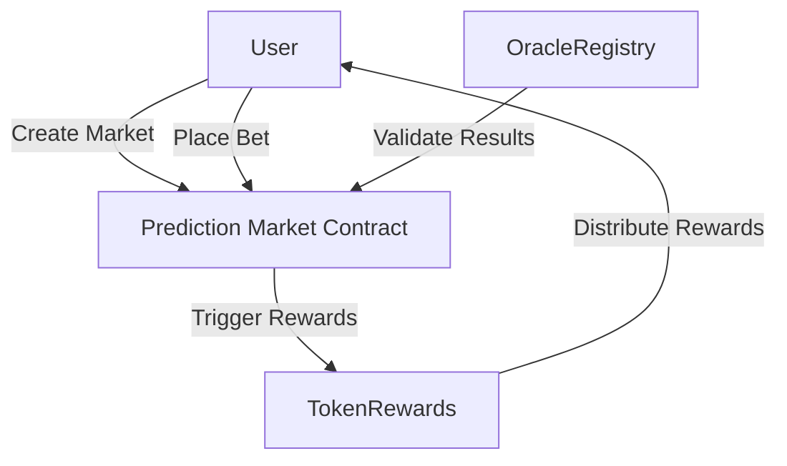

# Prediction Market Project Architecture

## Overview
This project implements a decentralized prediction market on the Stacks blockchain, leveraging Bitcoin settlement and trustless oracle mechanisms.

## System Components

### 1. Core Contracts
- **Prediction Market Contract**
  - Market creation
  - Betting mechanisms
  - Market resolution
  - State management

- **Oracle Registry Contract**
  - Oracle registration
  - Reputation tracking
  - Result validation

- **Token Rewards Contract**
  - Reward calculation
  - Incentive distribution
  - User reward tracking

## Architectural Principles
- Modularity
- Trustless design
- Secure state management
- Decentralized governance

## Component Interactions

## Security Considerations
- Strict access controls
- Immutable market creation
- Oracle reputation tracking
- Transparent resolution mechanism

## Future Extensibility
- Cross-chain interoperability
- Advanced betting mechanisms
- Dynamic oracle selection
